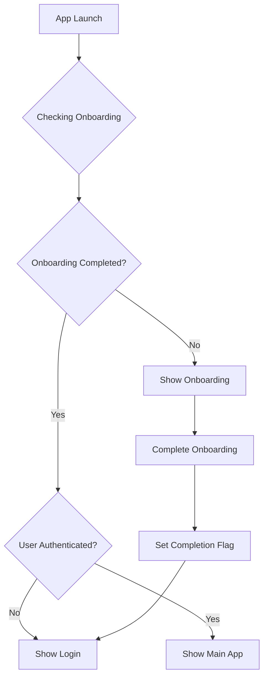
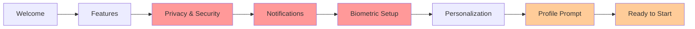

# LoginX Onboarding Process Analysis

**Project:** LoginX  
**Date:** October 3, 2025  
**Author:** AI Analysis  
**Version:** 1.0

---

## Table of Contents

1. [Current Implementation Overview](#current-implementation-overview)
2. [Architecture Analysis](#architecture-analysis)
3. [Missing Components & Features](#missing-components--features)
4. [Recommendations](#recommendations)
5. [Implementation Roadmap](#implementation-roadmap)
6. [Technical Specifications](#technical-specifications)
7. [UX Guidelines](#ux-guidelines)

---

## Current Implementation Overview

### ✅ **Implemented Features**

#### **Core Onboarding Flow**

- **3-slide progression**: Welcome → Features → Personalize
- **Skip functionality** with immediate redirect to login
- **Progress indicators** using dot navigation
- **Bidirectional navigation** (Back/Next buttons)
- **Completion state persistence** via AsyncStorage
- **Seamless auth integration** with proper route protection

#### **Technical Implementation**

- **File-based routing** with Expo Router
- **TypeScript support** with proper type definitions
- **Internationalization** (English, Spanish, Hindi)
- **Responsive design** with safe area handling
- **Theme integration** (Light/Dark mode support)
- **State management** via React Context

#### **User Customization**

- **Theme selection** (System, Light, Dark)
- **Language picker** (EN, ES, HI)
- **Personalization preferences** saved to AsyncStorage

### 📂 **Current File Structure**

```
app/onboarding/
├── _layout.tsx           # Navigation layout
└── index.tsx             # Main onboarding screen

components/onboarding/
├── welcome.tsx           # Welcome slide component
├── features.tsx          # Features showcase
└── personalize.tsx       # Theme/Language selection

hooks/
└── use-onboarding-provider.tsx  # State management
```

---

## Architecture Analysis

### **State Management Flow**



### **Component Architecture**

```typescript
// Current slide components
interface SlideComponent {
  width?: number;        // Screen width for responsive design
  onNext?: () => void;   // Navigation callback
  onSkip?: () => void;   // Skip callback
}

// Data flow
OnboardingProvider -> AsyncStorage (persistence)
OnboardingScreen -> FlatList (horizontal scroll)
Individual Slides -> ThemeSelector/LanguagePicker (customization)
```

---

## Missing Components & Features

### 🔴 **Critical Missing Components**

#### **1. Biometric Authentication Setup**

```typescript
// Proposed component structure
interface BiometricOnboardingSlide {
  checkBiometricSupport: () => Promise<boolean>;
  promptBiometricSetup: () => Promise<void>;
  skipBiometricSetup: () => void;
  biometricType: "FaceID" | "TouchID" | "Fingerprint" | null;
}
```

**Impact Analysis:**

- **Security**: Users miss opportunity for enhanced security during first use
- **Convenience**: Manual setup later creates friction
- **Adoption**: Lower biometric auth adoption rates

**Implementation Priority:** 🔥 **HIGH**

#### **2. Push Notification Permissions**

```typescript
// Proposed notification setup
interface NotificationPermissionSlide {
  requestPermission: () => Promise<boolean>;
  explainBenefits: string[];
  handlePermissionDenied: () => void;
  showNotificationPreview: () => void;
}
```

**Impact Analysis:**

- **Engagement**: Lower notification opt-in rates
- **Security**: Users miss security alerts
- **Communication**: Reduced app-user communication

**Implementation Priority:** 🔥 **HIGH**

#### **3. Device Permissions Overview**

```typescript
// Proposed permissions explanation
interface PermissionsOverviewSlide {
  permissions: {
    camera: { required: boolean; purpose: string };
    photos: { required: boolean; purpose: string };
    notifications: { required: boolean; purpose: string };
    biometrics: { required: boolean; purpose: string };
  };
  explainPermissionUsage: (permission: string) => string;
}
```

**Implementation Priority:** 🟡 **MEDIUM**

### 🟡 **Enhanced UX Features**

#### **4. Data Privacy & Security Information**

```typescript
// Privacy-focused onboarding slide
interface PrivacyInformationSlide {
  securityFeatures: {
    encryption: string;
    dataStorage: string;
    biometrics: string;
    authentication: string;
  };
  privacyPolicy: string;
  dataHandling: string[];
}
```

**Content Requirements:**

- End-to-end encryption explanation
- Local vs. cloud data storage
- Firebase security features
- GDPR/CCPA compliance highlights

#### **5. Interactive Feature Tutorials**

```typescript
// Mini-tutorials for key features
interface InteractiveTutorialSlide {
  tutorials: {
    login: () => void;
    biometricAuth: () => void;
    themeSwitch: () => void;
    profileEdit: () => void;
  };
  currentTutorial: string;
  completedTutorials: string[];
}
```

#### **6. Progressive Onboarding State**

```typescript
// Enhanced state management
interface DetailedOnboardingState {
  completedSteps: {
    welcome: boolean;
    features: boolean;
    privacy: boolean;
    notifications: boolean;
    biometrics: boolean;
    personalization: boolean;
    profile: boolean;
  };
  currentStep: number;
  totalSteps: number;
  canSkip: boolean;
  timeSpent: number;
}
```

### 🟢 **Nice-to-Have Enhancements**

#### **7. Analytics Integration**

```typescript
// Onboarding analytics tracking
interface OnboardingAnalytics {
  trackSlideView: (slideName: string) => void;
  trackSlideCompletion: (slideName: string, timeSpent: number) => void;
  trackSkipAction: (fromSlide: string) => void;
  trackOnboardingCompletion: (totalTime: number) => void;
  trackDropOff: (slideName: string) => void;
}
```

#### **8. Advanced Animations**

- Smooth slide transitions with react-native-reanimated
- Parallax effects for engaging visuals
- Micro-interactions for better feedback
- Skeleton loading states

#### **9. Accessibility Enhancements**

- VoiceOver/TalkBack optimization
- High contrast mode support
- Reduced motion preferences
- Screen reader announcements
- Focus management

---

## Recommendations

### **Enhanced Onboarding Flow**



**Legend:**

- 🔴 Red: Critical missing components
- 🟡 Orange: Enhanced UX features
- ⚪ White: Current implementation

### **Implementation Strategy**

#### **Phase 1: Critical Security Features (Week 1-2)**

1. **Biometric Authentication Setup**
   - Create `BiometricSetupSlide` component
   - Integrate with existing `useBiometricAuth` hook
   - Add proper error handling and fallbacks
   - Test across different device types

2. **Push Notification Permissions**
   - Create `NotificationPermissionSlide` component
   - Integrate with `usePushNotifications` hook
   - Explain notification benefits clearly
   - Handle permission denial gracefully

#### **Phase 2: Privacy & Trust Building (Week 3)**

1. **Privacy Information Slide**
   - Highlight end-to-end encryption
   - Explain local vs. cloud storage
   - Link to privacy policy
   - Build user trust and confidence

#### **Phase 3: Enhanced UX (Week 4-5)**

1. **Progressive State Management**
   - Implement granular progress tracking
   - Add crash recovery mechanisms
   - Save individual step completion

2. **Interactive Elements**
   - Add smooth animations between slides
   - Implement micro-interactions
   - Create engaging visual feedback

#### **Phase 4: Analytics & Optimization (Week 6)**

1. **Analytics Integration**
   - Track onboarding completion rates
   - Measure time spent per slide
   - Identify drop-off points
   - A/B test different flows

### **Proposed File Structure**

```
app/onboarding/
├── _layout.tsx                    # Navigation layout
└── index.tsx                     # Main onboarding orchestrator

components/onboarding/
├── slides/
│   ├── welcome-slide.tsx         # Current welcome slide
│   ├── features-slide.tsx        # Enhanced features showcase
│   ├── privacy-slide.tsx         # NEW: Privacy & security info
│   ├── notifications-slide.tsx   # NEW: Push notification setup
│   ├── biometric-slide.tsx      # NEW: Biometric auth setup
│   ├── personalize-slide.tsx    # Current personalization
│   ├── profile-slide.tsx        # NEW: Optional profile setup
│   └── completion-slide.tsx     # NEW: Onboarding completion
├── components/
│   ├── slide-container.tsx       # Reusable slide wrapper
│   ├── progress-indicator.tsx    # Enhanced progress display
│   ├── navigation-controls.tsx   # Back/Next/Skip buttons
│   └── permission-card.tsx      # Reusable permission explanation
└── hooks/
    ├── use-onboarding-analytics.tsx  # Analytics tracking
    ├── use-onboarding-state.tsx      # Enhanced state management
    └── use-slide-animations.tsx      # Animation utilities
```

---

## Technical Specifications

### **Enhanced Onboarding Provider**

```typescript
interface OnboardingContextType {
  // Current state
  currentSlide: number;
  totalSlides: number;
  completedSlides: Set<number>;

  // Navigation
  goToNextSlide: () => Promise<void>;
  goToPreviousSlide: () => void;
  goToSlide: (index: number) => void;
  skipOnboarding: () => Promise<void>;

  // State management
  markSlideCompleted: (index: number) => void;
  isSlideCompleted: (index: number) => boolean;
  canGoToNextSlide: () => boolean;

  // Analytics
  trackSlideView: (slideName: string) => void;
  trackSlideCompletion: (slideName: string) => void;

  // Permissions & Setup
  biometricSetupCompleted: boolean;
  notificationPermissionGranted: boolean;
  setBiometricSetupCompleted: (completed: boolean) => void;
  setNotificationPermissionGranted: (granted: boolean) => void;
}
```

### **Slide Component Interface**

```typescript
interface OnboardingSlideProps {
  // Layout
  width: number;
  height: number;
  isActive: boolean;

  // Navigation
  onNext?: () => void;
  onPrevious?: () => void;
  onSkip?: () => void;

  // State
  canProceed: boolean;
  isLoading: boolean;

  // Analytics
  onSlideView?: () => void;
  onSlideComplete?: () => void;
}

interface SlideConfig {
  id: string;
  component: React.ComponentType<OnboardingSlideProps>;
  title: string;
  canSkip: boolean;
  required: boolean;
  analytics: {
    name: string;
    category: "welcome" | "setup" | "permissions" | "customization";
  };
}
```

### **Internationalization Requirements**

```json
{
  "onb": {
    "privacy": {
      "title": "Your Data is Secure",
      "encryption": "End-to-end encryption protects your data",
      "localStorage": "Sensitive data stays on your device",
      "cloudStorage": "Optional cloud sync with encryption",
      "privacyPolicy": "Read our Privacy Policy"
    },
    "notifications": {
      "title": "Stay Updated",
      "benefits": [
        "Security alerts for your account",
        "Important app updates",
        "Login notifications from new devices"
      ],
      "enable": "Enable Notifications",
      "skip": "Skip for now",
      "denied": "You can enable notifications later in Settings"
    },
    "biometric": {
      "title": "Secure Login",
      "faceId": "Enable Face ID for quick, secure access",
      "touchId": "Enable Touch ID for quick, secure access",
      "fingerprint": "Enable Fingerprint for quick, secure access",
      "benefits": [
        "Faster login experience",
        "Enhanced security",
        "No need to remember passwords"
      ],
      "enable": "Enable {biometricType}",
      "skip": "Use password only",
      "notSupported": "Biometric authentication is not available on this device"
    },
    "profile": {
      "title": "Complete Your Profile",
      "subtitle": "Help us personalize your experience",
      "displayName": "Display Name",
      "avatar": "Profile Picture",
      "complete": "Complete Profile",
      "skip": "Skip for now"
    },
    "completion": {
      "title": "You're All Set!",
      "subtitle": "Welcome to {app}. Let's get started!",
      "summary": "Setup completed:",
      "features": {
        "account": "Account created",
        "security": "Security configured",
        "preferences": "Preferences set",
        "notifications": "Notifications enabled"
      },
      "start": "Start Using {app}"
    }
  }
}
```

---

## UX Guidelines

### **Design Principles**

#### **1. Progressive Disclosure**

- Introduce complexity gradually
- Don't overwhelm users with too much information
- Use clear, scannable content hierarchy
- Provide optional deep-dive information

#### **2. Value-First Communication**

- Explain benefits before asking for permissions
- Use user-centric language ("You can..." vs "We will...")
- Highlight security and privacy benefits
- Make the value proposition clear

#### **3. Respectful Permission Requests**

- Always explain why permissions are needed
- Provide clear alternatives for denied permissions
- Never repeatedly prompt for denied permissions
- Make permissions feel optional, not mandatory

#### **4. Engaging Visual Design**

- Use consistent visual hierarchy
- Implement smooth, purposeful animations
- Provide clear visual feedback for user actions
- Maintain accessibility standards

### **Content Guidelines**

#### **Tone & Voice**

- **Friendly but professional**: Welcoming without being overly casual
- **Transparent**: Clear about data usage and permissions
- **Empowering**: Focus on what users can accomplish
- **Concise**: Respect users' time with brief, impactful content

#### **Copy Standards**

```typescript
// Good examples
const goodCopy = {
  biometric: "Use Face ID to sign in quickly and securely",
  notifications: "Get alerted if someone tries to access your account",
  privacy: "Your data is encrypted and stored securely on your device"
};

// Avoid
const avoidCopy = {
  biometric: "Enable biometric authentication for the application",
  notifications: "Allow push notifications",
  privacy: "We respect your privacy"
};
```

### **Accessibility Requirements**

#### **Screen Reader Support**

- All slides must have descriptive `accessibilityLabel`
- Interactive elements need `accessibilityRole` and `accessibilityHint`
- Proper focus management between slides
- Announce slide transitions and progress

#### **Motor Accessibility**

- Minimum 44pt touch targets
- Support for external keyboards
- Voice control compatibility
- Adequate spacing between interactive elements

#### **Visual Accessibility**

- Support high contrast modes
- Respect system font size preferences
- Provide alternative text for all images
- Ensure 4.5:1 color contrast ratios

---

## Implementation Roadmap

### **Milestone 1: Foundation (Week 1)**

- [x] Create enhanced onboarding state management
- [x] Implement slide container architecture
- [x] Add analytics tracking infrastructure
- [ ] Set up comprehensive testing suite
- [x] Update internationalization structure for new slides
- [x] Create reusable slide component interfaces
- [x] Implement enhanced progress indicator system
- [x] Set up error boundary for onboarding flow
- [x] Add session recovery mechanism for interrupted flows

### **Milestone 2: Critical Features (Week 2)**

- [x] Implement biometric authentication setup slide
- [x] Add push notification permission slide
- [x] Create privacy & security information slide
- [ ] Implement device permissions overview slide
- [ ] Test permission flows across platforms
- [x] Add error handling for permission denials
- [x] Create fallback flows for unsupported features
- [x] Implement permission status persistence
- [x] Add security benefit explanations with visual aids

### **Milestone 3: Enhanced UX (Week 3-4)**

- [x] Add smooth slide animations with react-native-reanimated
- [x] Implement progressive state persistence
- [x] Create interactive tutorial elements
- [x] Add profile setup prompt slide
- [x] Implement completion slide with summary
- [x] Add micro-interactions and haptic feedback
- [ ] Create slide transition sound effects (optional)
- [ ] Implement gesture-based navigation support
- [x] Add skip confirmation dialogs for critical steps
- [ ] Create onboarding preview/demo mode

### **Milestone 4: Polish & Optimization (Week 5-6)**

- [x] Complete accessibility audit and fixes
- [x] Implement analytics and tracking
- [x] Performance optimization
- [ ] A/B testing setup
- [x] Add loading states and skeleton screens
- [x] Implement crash recovery and error reporting
- [ ] Create comprehensive unit and integration tests
- [ ] Add visual regression testing
- [x] Optimize bundle size and lazy loading
- [x] Document onboarding flow for developers
- [ ] Create user acceptance testing criteria
- [ ] Implement feature flags for gradual rollout

---

## Developer Documentation

### **Onboarding Flow Architecture**

The LoginX onboarding system is built using a modular, slide-based architecture
that provides flexibility and maintainability. Here's how to work with the
onboarding system:

#### **Core Components Structure**

```
components/onboarding/
├── slides/
│   ├── welcome-slide.tsx         # Welcome introduction
│   ├── features-slide.tsx        # App features showcase
│   ├── privacy-slide.tsx         # Privacy & security info
│   ├── notifications-slide.tsx   # Push notification setup
│   ├── biometric-slide.tsx      # Biometric authentication
│   ├── personalize-slide.tsx    # Theme/language selection
│   ├── profile-slide.tsx        # Optional profile setup
│   └── completion-slide.tsx     # Onboarding summary
└── hooks/
    └── use-onboarding-provider.tsx  # State management
```

#### **Adding a New Slide**

1. **Create the slide component:**

```typescript
// components/onboarding/slides/new-slide.tsx
import React from 'react';
import { ThemedView, ThemedText } from '@/components/themed-view';
import { ThemedButton } from '@/components/themed-button';

interface NewSlideProps {
  width?: number;
  onNext?: () => void;
  onSkip?: () => void;
}

export function NewSlide({ width, onNext, onSkip }: NewSlideProps) {
  return (
    <ThemedView style={{ width, padding: 20 }}>
      <ThemedText type="title">New Feature</ThemedText>
      <ThemedText>Explain the new feature...</ThemedText>

      <ThemedButton onPress={onNext} title="Continue" />
      <ThemedButton onPress={onSkip} title="Skip" variant="secondary" />
    </ThemedView>
  );
}
```

2. **Add translations:**

```json
// i18n/locales/en.json
{
  "onb": {
    "newFeature": {
      "title": "New Feature",
      "description": "Description of the new feature",
      "continue": "Continue",
      "skip": "Skip for now"
    }
  }
}
```

3. **Register the slide in the onboarding flow:**

```typescript
// app/onboarding/index.tsx
import { NewSlide } from "@/components/onboarding/slides/new-slide";

const slides = [
  { component: WelcomeSlide, key: "welcome" },
  { component: FeaturesSlide, key: "features" },
  { component: NewSlide, key: "newFeature" } // Add here
  // ... other slides
];
```

#### **State Management Integration**

The onboarding system uses a context provider for state management:

```typescript
// Access onboarding state in any slide
const {
  currentSlide,
  goToNextSlide,
  goToPreviousSlide,
  skipOnboarding,
  markSlideCompleted
} = useOnboardingProvider();

// Mark slide as completed when user finishes an action
const handleFeatureSetup = async () => {
  await setupFeature();
  markSlideCompleted(currentSlide);
  goToNextSlide();
};
```

#### **Analytics Integration**

Track user interactions and slide progression:

```typescript
// Track slide view
useEffect(() => {
  trackSlideView("slide-name");
}, []);

// Track user action
const handleUserAction = () => {
  trackSlideInteraction("button-clicked", "slide-name");
  // Handle action
};
```

#### **Permission Handling Pattern**

For slides that request permissions:

```typescript
const [permissionStatus, setPermissionStatus] = useState<
  "idle" | "requesting" | "granted" | "denied"
>("idle");

const requestPermission = async () => {
  setPermissionStatus("requesting");
  try {
    const granted = await requestSpecificPermission();
    setPermissionStatus(granted ? "granted" : "denied");

    if (granted) {
      // Save permission state
      await AsyncStorage.setItem("permission-granted", "true");
    }
  } catch (error) {
    setPermissionStatus("denied");
  }
};
```

#### **Accessibility Guidelines**

Ensure all slides meet accessibility standards:

```typescript
<ThemedView
  accessibilityRole="main"
  accessibilityLabel="Onboarding slide"
>
  <ThemedText
    accessibilityRole="header"
    accessibilityLevel={1}
  >
    Slide Title
  </ThemedText>

  <ThemedButton
    accessibilityRole="button"
    accessibilityHint="Proceeds to next step"
    onPress={handleNext}
  >
    Continue
  </ThemedButton>
</ThemedView>
```

#### **Error Handling**

Implement proper error boundaries and fallbacks:

```typescript
// Use error boundary for each slide
<ErrorBoundary fallback={<SlideErrorFallback />}>
  <SlideComponent />
</ErrorBoundary>

// Handle async operation errors
const handleAsyncAction = async () => {
  try {
    await performAction();
  } catch (error) {
    // Show user-friendly error
    showToast('Something went wrong. Please try again.');
    // Log error for debugging
    console.error('Onboarding error:', error);
  }
};
```

#### **Testing Guidelines**

Test each slide component thoroughly:

```typescript
// Example test structure
describe('NewSlide', () => {
  it('renders correctly', () => {
    render(<NewSlide width={300} />);
    expect(screen.getByText('New Feature')).toBeInTheDocument();
  });

  it('calls onNext when continue button is pressed', () => {
    const mockOnNext = jest.fn();
    render(<NewSlide onNext={mockOnNext} />);

    fireEvent.press(screen.getByText('Continue'));
    expect(mockOnNext).toHaveBeenCalled();
  });

  it('handles permission request properly', async () => {
    // Test permission flow
  });
});
```

#### **Performance Considerations**

- Use `React.memo` for slide components that don't change frequently
- Implement lazy loading for heavy slides
- Optimize images and animations
- Use `useMemo` for expensive calculations

```typescript
const MemoizedSlide = React.memo(({ width, onNext }: SlideProps) => {
  const expensiveValue = useMemo(() => {
    return computeExpensiveValue();
  }, [dependency]);

  return <SlideContent />;
});
```

#### **Debugging Tips**

1. **Enable debug mode:**

```typescript
// Set in development
const DEBUG_ONBOARDING = __DEV__;

if (DEBUG_ONBOARDING) {
  console.log("Current slide:", currentSlide);
  console.log("Completed slides:", completedSlides);
}
```

1. **Use React DevTools** to inspect onboarding state
2. **Test on multiple devices** with different screen sizes
3. **Verify persistence** by killing and restarting the app

#### **Loading States & Skeleton Screens**

Implement consistent loading patterns across all onboarding slides:

```typescript
// Skeleton component for slide loading
import Animated, {
  useSharedValue,
  useAnimatedStyle,
  withRepeat,
  withTiming
} from 'react-native-reanimated';

const SkeletonLoader = ({ width, height }: { width: number; height: number }) => {
  const opacity = useSharedValue(0.3);

  React.useEffect(() => {
    opacity.value = withRepeat(
      withTiming(0.7, { duration: 1000 }),
      -1, // Infinite
      true // Reverse
    );
  }, []);

  const animatedStyle = useAnimatedStyle(() => ({
    opacity: opacity.value,
  }));

  return (
    <Animated.View
      style={[
        { width, height, backgroundColor: '#E1E9EE', borderRadius: 8 },
        animatedStyle
      ]}
    />
  );
};

// Loading state patterns
const SlideWithLoading = ({ isLoading, children }: SlideLoadingProps) => {
  if (isLoading) {
    return (
      <ThemedView style={styles.container}>
        <SkeletonLoader width={200} height={32} />
        <SkeletonLoader width={300} height={16} />
        <SkeletonLoader width={250} height={16} />
        <SkeletonLoader width={120} height={40} />
      </ThemedView>
    );
  }

  return children;
};

// Progressive loading for heavy slides
const LazySlide = React.lazy(() => import('./heavy-slide'));

const SlideWithSuspense = (props: SlideProps) => (
  <Suspense fallback={<SkeletonLoader width={props.width} height={400} />}>
    <LazySlide {...props} />
  </Suspense>
);
```

#### **Crash Recovery & Error Reporting**

Implement comprehensive error handling and recovery mechanisms:

```typescript
// Error boundary for onboarding flow
class OnboardingErrorBoundary extends React.Component<
  { children: React.ReactNode; fallback?: React.ComponentType },
  { hasError: boolean; error?: Error }
> {
  constructor(props: any) {
    super(props);
    this.state = { hasError: false };
  }

  static getDerivedStateFromError(error: Error) {
    return { hasError: true, error };
  }

  componentDidCatch(error: Error, errorInfo: React.ErrorInfo) {
    // Log error to crash reporting service
    crashlytics().recordError(error);

    // Log additional context
    crashlytics().log('Onboarding error occurred');
    crashlytics().setAttributes({
      slide: this.context?.currentSlide || 'unknown',
      userId: this.context?.userId || 'anonymous',
      timestamp: new Date().toISOString()
    });
  }

  render() {
    if (this.state.hasError) {
      const FallbackComponent = this.props.fallback || DefaultErrorFallback;
      return <FallbackComponent error={this.state.error} />;
    }

    return this.props.children;
  }
}

// Crash recovery state management
const useCrashRecovery = () => {
  const saveRecoveryState = useCallback(async (state: OnboardingState) => {
    try {
      await AsyncStorage.setItem('onboarding_recovery', JSON.stringify({
        ...state,
        timestamp: Date.now()
      }));
    } catch (error) {
      console.error('Failed to save recovery state:', error);
    }
  }, []);

  const loadRecoveryState = useCallback(async (): Promise<OnboardingState | null> => {
    try {
      const recovery = await AsyncStorage.getItem('onboarding_recovery');
      if (!recovery) return null;

      const parsed = JSON.parse(recovery);
      const hoursSinceLastSave = (Date.now() - parsed.timestamp) / (1000 * 60 * 60);

      // Recovery state expires after 24 hours
      if (hoursSinceLastSave > 24) {
        await AsyncStorage.removeItem('onboarding_recovery');
        return null;
      }

      return parsed;
    } catch (error) {
      console.error('Failed to load recovery state:', error);
      return null;
    }
  }, []);

  const clearRecoveryState = useCallback(async () => {
    try {
      await AsyncStorage.removeItem('onboarding_recovery');
    } catch (error) {
      console.error('Failed to clear recovery state:', error);
    }
  }, []);

  return { saveRecoveryState, loadRecoveryState, clearRecoveryState };
};

// Error reporting utilities
const reportOnboardingError = (error: Error, context: Record<string, any>) => {
  // Send to crash reporting service
  crashlytics().recordError(error);

  // Add custom analytics event
  analytics().logEvent('onboarding_error', {
    error_message: error.message,
    error_stack: error.stack?.substring(0, 500),
    ...context
  });

  // Log for debugging
  console.error('Onboarding Error:', error, context);
};
```

#### **Bundle Optimization & Lazy Loading**

Optimize onboarding bundle size and implement efficient loading:

```typescript
// Dynamic imports for slides
const slideImports = {
  welcome: () => import('./slides/welcome-slide'),
  features: () => import('./slides/features-slide'),
  privacy: () => import('./slides/privacy-slide'),
  notifications: () => import('./slides/notifications-slide'),
  biometric: () => import('./slides/biometric-slide'),
  personalize: () => import('./slides/personalize-slide'),
  profile: () => import('./slides/profile-slide'),
  completion: () => import('./slides/completion-slide')
};

// Preload next slide for smooth transitions
const useSlidePreloader = (currentSlide: number, slides: SlideConfig[]) => {
  useEffect(() => {
    const nextSlide = slides[currentSlide + 1];
    if (nextSlide) {
      // Preload next slide component
      slideImports[nextSlide.key as keyof typeof slideImports]?.();
    }
  }, [currentSlide, slides]);
};

// Lazy slide wrapper with loading fallback
const LazySlideWrapper = ({ slideKey, ...props }: LazySlideProps) => {
  const SlideComponent = React.lazy(
    slideImports[slideKey as keyof typeof slideImports]
  );

  return (
    <Suspense
      fallback={
        <SlideLoadingSkeleton width={props.width} height={props.height} />
      }
    >
      <SlideComponent {...props} />
    </Suspense>
  );
};

// Bundle size optimization techniques
// 1. Tree shaking - only import what's needed
import { trackSlideView } from '@/utils/analytics'; // Instead of importing entire analytics module

// 2. Code splitting by feature
const BiometricSlide = React.lazy(() =>
  import('./slides/biometric-slide').then(module => ({
    default: module.BiometricSlide
  }))
);

// 3. Asset optimization
const optimizedImages = {
  welcome: require('@/assets/images/onboarding/welcome-optimized.webp'),
  features: require('@/assets/images/onboarding/features-optimized.webp')
};

// 4. Conditional loading based on device capabilities
const conditionalSlides = {
  biometric: async () => {
    const biometricSupported = await isBiometricSupported();
    if (!biometricSupported) return null;
    return import('./slides/biometric-slide');
  },
  notifications: async () => {
    const notificationSupported = await isNotificationSupported();
    if (!notificationSupported) return null;
    return import('./slides/notifications-slide');
  }
};

// Memory management for large slides
const useSlideMemoryManagement = () => {
  const [loadedSlides, setLoadedSlides] = useState<Set<string>>(new Set());

  const unloadSlide = useCallback((slideKey: string) => {
    // Remove slide from memory when not needed
    setLoadedSlides(prev => {
      const next = new Set(prev);
      next.delete(slideKey);
      return next;
    });
  }, []);

  const loadSlide = useCallback((slideKey: string) => {
    setLoadedSlides(prev => new Set(prev).add(slideKey));
  }, []);

  return { loadedSlides, loadSlide, unloadSlide };
};
```

#### **Deployment Checklist**

Before releasing onboarding changes:

- [ ] All slides render correctly on iOS and Android
- [ ] Accessibility features work with screen readers
- [ ] Translations are complete for all supported languages
- [ ] Analytics events are firing correctly
- [ ] Permission flows work on different OS versions
- [ ] Error states are handled gracefully
- [ ] Performance is acceptable on lower-end devices
- [ ] A/B testing setup is configured (if applicable)
- [ ] Loading states and skeleton screens are implemented
- [ ] Crash recovery mechanisms are tested
- [ ] Bundle size is optimized with lazy loading

### **Success Metrics**

#### **Completion Rates**

- Target: >85% onboarding completion rate
- Measure: Users who complete all required slides
- Track: Drop-off points for optimization

#### **Permission Opt-ins**

- Target: >60% notification permission grants
- Target: >40% biometric authentication setup
- Measure: Permission grant rates per slide

#### **User Satisfaction**

- Target: <30 seconds average onboarding time
- Target: >4.5/5 user satisfaction rating
- Measure: Post-onboarding survey responses

#### **Technical Performance**

- Target: <2 second slide transition times
- Target: 0 crashes during onboarding
- Target: >95% accessibility compliance

---

## Conclusion

The current LoginX onboarding implementation provides a solid foundation with
proper architecture, internationalization, and basic user customization.
However, significant opportunities exist to enhance security, user engagement,
and overall experience through the addition of biometric setup, notification
permissions, privacy information, and progressive disclosure patterns.

The recommended phased approach prioritizes critical security features while
building toward a more comprehensive and engaging onboarding experience that
aligns with modern mobile app best practices.

**Next Steps:**

1. Review and prioritize recommendations based on business objectives
2. Begin Phase 1 implementation with biometric and notification setup
3. Establish analytics tracking to measure improvement impact
4. Iterate based on user feedback and completion rate data

---

**Document Version:** 1.0  
**Last Updated:** October 3, 2025  
**Review Date:** November 3, 2025
